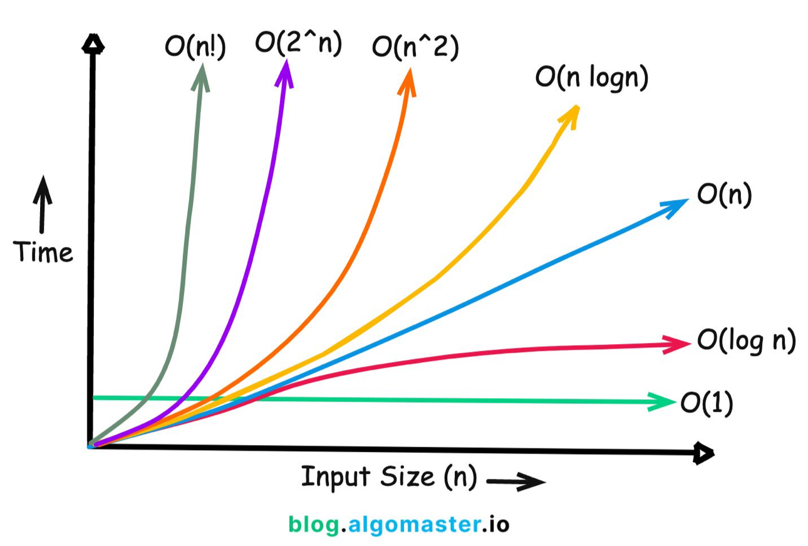
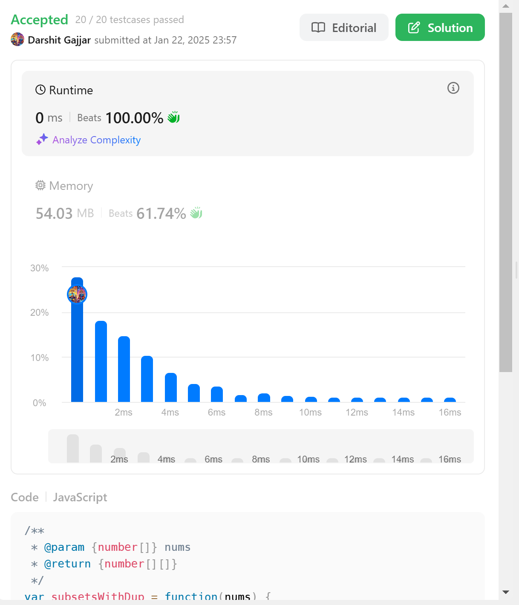

# LeetCode Quote

```javascript
console.log(
  "Don't run behind number of questions on LeetCode. Try to learn concept first. If you know the concept, question will be fun for you"
);
```

## Daily LeetCode Practice in JavaScript

Welcome to my Daily LeetCode Practice repository! In this repository, I'll be regularly solving LeetCode problems using JavaScript. The primary focus of my daily practice includes solving problems related to arrays, strings, data structures, and algorithms. Each day, I will add a new solution to this repository, and you can find the code for that day in its corresponding folder.

## What's Inside

- **Array Challenges:** Solutions to various LeetCode array-related problems.
- **String Challenges:** Solutions to problems that involve string manipulation.
- **Data Structures:** Implementations of common data structures in JavaScript.
- **Algorithms:** Implementations of well-known algorithms for problem-solving.

## How to Use This Repository

Feel free to explore the code and solutions as a reference for your own LeetCode practice or to learn more about algorithms and data structures. You can find each day's solution in its respective folder within this repository.

## Get Started

To get started, simply explore the folders in this repository, and you'll find the solutions to the LeetCode problems I've tackled. Whether you're a beginner looking to improve your coding skills or an experienced developer seeking to refresh your algorithmic knowledge, I hope you find this repository helpful.

Happy coding and enjoy your LeetCode journey! 🚀

## Track My Progress, Darshit Please Update this Sheet

https://docs.google.com/spreadsheets/d/1EAk9RhWCYQgi26pH23tNjWY52Ff8MKnljsYeyvhcUkA/edit?usp=sharing

https://docs.google.com/spreadsheets/d/1BvNKHb2fRXxFoaLEjvXzlKXRe3I0byHC6Vco41DE0Nc/edit?usp=sharing

- Topic Wise Practices: https://neetcode.io/practice
- Notes of mine: https://gist.github.com/gajjardarshithasmukhbhai/a56a104fb578c8777235e9acf1df7c62

### Time Complexity of Various Algo





### Useful Mathematical Equations

- **Number of non-empty contiguous subarrays in an array of length n:**

  ```
  Total subarrays = n * (n + 1) / 2
  ```
  For example, if `n = 5`, then total subarrays = 5 × 6 / 2 = 15.

- **Number of possible subsets of an array of length n (Power Set):**

  ```
  Total subsets = 2^n
  ```
  (Includes the empty set.)

- **Number of ways to choose k elements from n (Combinations):**

  ```
  C(n, k) = n! / (k! * (n - k)!)
  ```

- **Number of permutations of n distinct elements:**

  ```
  P(n) = n!
  ```

- **Sum of first n natural numbers:**

  ```
  S = n * (n + 1) / 2
  ```

- **Sum of first n squares:**

  ```
  S = n * (n + 1) * (2n + 1) / 6
  ```

- **Sum of first n cubes:**

  ```
  S = (n * (n + 1) / 2)^2
  ```

- **Binary Search Time Complexity:**  
  ```
  O(log n)
  ```

- **Merge Sort Time Complexity:**  
  ```
  O(n log n)
  ```

- **Quick Sort Average Time Complexity:**  
  ```
  O(n log n)
  ```

- **Space Complexity for Recursion (call stack):**  
  ```
  O(depth of recursion)
  ```

- **Number of edges in a complete graph with n nodes:**

  ```
  E = n * (n - 1) / 2
  ```

- **Catalan Number (useful for counting BSTs, valid parentheses, etc.):**

  ```
  C_n = (1 / (n + 1)) * C(2n, n)
  ```

- **Fibonacci Sequence (recursive definition):**

  ```
  F(n) = F(n - 1) + F(n - 2)
  F(0) = 0, F(1) = 1
  ```

- **Height of a complete binary tree with n nodes:**

  ```
  h = floor(log2(n))
  ```

### Algorithm & Data Structure Complexity Table

| Algorithm / Data Structure      | Operation         | Time Complexity | Space Complexity | Notes                                 |
|---------------------------------|-------------------|-----------------|------------------|----------------------------------------|
| **Array**                      | Access            | O(1)            | O(n)             | Direct index access                    |
|                                 | Search (unsorted) | O(n)            | O(1)             | Linear search                          |
|                                 | Search (sorted)   | O(log n)        | O(1)             | Binary search                          |
|                                 | Insert/Delete     | O(n)            | O(1)             | At arbitrary position                  |
| **Linked List (Singly)**        | Search            | O(n)            | O(n)             | Traverse from head                     |
|                                 | Insert/Delete     | O(1)            | O(n)             | At head/tail (with tail pointer)       |
| **Stack**                       | Push/Pop          | O(1)            | O(n)             |                                        |
| **Queue**                       | Enqueue/Dequeue   | O(1)            | O(n)             |                                        |
| **Hash Table**                  | Search            | O(1) (avg)      | O(n)             | O(n) worst case (collisions)           |
|                                 | Insert/Delete     | O(1) (avg)      | O(n)             |                                        |
| **Binary Search Tree (BST)**    | Search            | O(log n)        | O(n)             | O(n) worst case (unbalanced)           |
|                                 | Insert/Delete     | O(log n)        | O(n)             |                                        |
| **Balanced BST (AVL/Red-Black)**| Search            | O(log n)        | O(n)             | Always balanced                        |
|                                 | Insert/Delete     | O(log n)        | O(n)             |                                        |
| **Heap (Priority Queue)**       | Insert            | O(log n)        | O(n)             |                                        |
|                                 | Extract-Min/Max   | O(log n)        | O(n)             |                                        |
| **Graph (Adjacency List)**      | Add Edge          | O(1)            | O(V+E)           | V = vertices, E = edges                |
|                                 | Search (BFS/DFS)  | O(V+E)          | O(V)             |                                        |
| **Graph (Adjacency Matrix)**    | Add Edge          | O(1)            | O(V^2)           |                                        |
|                                 | Search (BFS/DFS)  | O(V^2)          | O(V)             |                                        |
| **Sorting Algorithms**          | Bubble Sort       | O(n^2)          | O(1)             |                                        |
|                                 | Selection Sort    | O(n^2)          | O(1)             |                                        |
|                                 | Insertion Sort    | O(n^2)          | O(1)             |                                        |
|                                 | Merge Sort        | O(n log n)      | O(n)             |                                        |
|                                 | Quick Sort        | O(n log n) avg  | O(log n)         | O(n^2) worst case                      |
|                                 | Heap Sort         | O(n log n)      | O(1)             |                                        |
| **Trie**                        | Insert/Search     | O(L)            | O(ALPHABET * N)  | L = word length, N = words             |

## Algorithms Insights & JavaScript Implementations

### 1. Two Pointers Technique

**Description:** A technique that uses two pointers to traverse data structures, typically arrays or strings, from different positions. The pointers can move towards each other, in the same direction, or at different speeds. This approach is particularly effective for problems involving pairs or comparisons between elements at different positions.

**Core Concept:** Instead of using nested loops (O(n²)), we use two pointers to reduce time complexity to O(n). The key insight is that by maintaining certain properties (like sorted order), we can eliminate the need to check all possible combinations.

**When to use:** Array/string problems involving pairs, triplets, or when you need to compare elements from different positions.

**Use cases:** Remove duplicates, find pairs with target sum, palindrome checking, merge sorted arrays.

```javascript
// Two Sum (sorted array)
function twoSum(nums, target) {
    let left = 0, right = nums.length - 1;
    
    while (left < right) {
        const sum = nums[left] + nums[right];
        if (sum === target) return [left, right];
        else if (sum < target) left++;
        else right--;
    }
    return [];
}

// Remove duplicates from sorted array
function removeDuplicates(nums) {
    if (nums.length <= 1) return nums.length;
    
    let writeIndex = 1;
    for (let i = 1; i < nums.length; i++) {
        if (nums[i] !== nums[i - 1]) {
            nums[writeIndex++] = nums[i];
        }
    }
    return writeIndex;
}
```

### 2. Sliding Window

**Description:** A technique that maintains a window (subarray) of elements and slides it across the data structure. The window can be of fixed or variable size. As the window slides, elements are added to one end and removed from the other, maintaining certain properties or constraints.

**Core Concept:** Instead of recalculating the result for every subarray from scratch, we incrementally update our result by adding new elements and removing old ones. This transforms O(n×k) or O(n²) solutions into O(n) solutions.

**When to use:** Subarray/substring problems with contiguous elements, especially with size constraints.

**Use cases:** Maximum subarray sum, longest substring without repeating characters, minimum window substring.

#### Fixed-Size Sliding Window

**Description:** The window size remains constant throughout the algorithm. We slide the window by removing the leftmost element and adding a new rightmost element.

**Key Characteristics:**
- Window size `k` is predetermined and constant
- Simple template: calculate initial window, then slide by removing left and adding right
- Time complexity: O(n), Space complexity: O(1) typically
- Perfect for problems asking about "subarrays of size k"

**When to use Fixed-Size:**
- Maximum/minimum sum of k consecutive elements
- Average of k elements
- Finding specific patterns in fixed-length subarrays
- Problems with explicit window size constraint

**Template Pattern:**
```javascript
function fixedSlidingWindow(arr, k) {
    let windowSum = 0;
    let result = 0;
    
    // Calculate sum of first window
    for (let i = 0; i < k; i++) {
        windowSum += arr[i];
    }
    result = windowSum;
    
    // Slide the window
    for (let i = k; i < arr.length; i++) {
        windowSum = windowSum - arr[i - k] + arr[i];
        result = Math.max(result, windowSum); // or any operation
    }
    
    return result;
}
```

```javascript
// Fixed size sliding window - max sum of k elements
function maxSumSubarray(nums, k) {
    let maxSum = 0, windowSum = 0;
    
    // Calculate sum of first window
    for (let i = 0; i < k; i++) {
        windowSum += nums[i];
    }
    maxSum = windowSum;
    
    // Slide the window
    for (let i = k; i < nums.length; i++) {
        windowSum = windowSum - nums[i - k] + nums[i];
        maxSum = Math.max(maxSum, windowSum);
    }
    return maxSum;
}

// Find all anagrams in string - fixed window size
function findAnagrams(s, p) {
    if (s.length < p.length) return [];
    
    const result = [];
    const pCount = new Array(26).fill(0);
    const windowCount = new Array(26).fill(0);
    
    // Count characters in pattern
    for (const char of p) {
        pCount[char.charCodeAt(0) - 97]++;
    }
    
    const windowSize = p.length;
    
    // Process first window
    for (let i = 0; i < windowSize; i++) {
        windowCount[s.charCodeAt(i) - 97]++;
    }
    
    if (arraysEqual(pCount, windowCount)) {
        result.push(0);
    }
    
    // Slide the window
    for (let i = windowSize; i < s.length; i++) {
        // Add new character
        windowCount[s.charCodeAt(i) - 97]++;
        // Remove old character
        windowCount[s.charCodeAt(i - windowSize) - 97]--;
        
        if (arraysEqual(pCount, windowCount)) {
            result.push(i - windowSize + 1);
        }
    }
    
    return result;
}

function arraysEqual(arr1, arr2) {
    return arr1.every((val, index) => val === arr2[index]);
}

// Maximum average subarray - fixed size
function findMaxAverage(nums, k) {
    let sum = 0;
    
    // Calculate sum of first k elements
    for (let i = 0; i < k; i++) {
        sum += nums[i];
    }
    
    let maxSum = sum;
    
    // Slide the window
    for (let i = k; i < nums.length; i++) {
        sum = sum - nums[i - k] + nums[i];
        maxSum = Math.max(maxSum, sum);
    }
    
    return maxSum / k;
}

// Contains duplicate within k distance - fixed constraint
function containsNearbyDuplicate(nums, k) {
    const window = new Set();
    
    for (let i = 0; i < nums.length; i++) {
        // Remove element outside window
        if (i > k) {
            window.delete(nums[i - k - 1]);
        }
        
        // Check if current element is in window
        if (window.has(nums[i])) {
            return true;
        }
        
        window.add(nums[i]);
    }
    
    return false;
}
```

#### Variable-Size Sliding Window

**Description:** The window size changes dynamically based on certain conditions. We expand the window by moving the right pointer and shrink it by moving the left pointer.

**Key Characteristics:**
- Window size varies based on problem constraints
- Uses two pointers (left and right) to control window boundaries
- Expand window when condition is not met, shrink when condition is violated
- More complex logic but very powerful for optimization problems

**When to use Variable-Size:**
- Longest/shortest subarray with certain properties
- Subarray with sum equal to target
- Substring problems with character constraints
- Problems asking for "minimum/maximum length"

**Template Patterns:**

**Pattern 1: Find Maximum Length**
```javascript
function maxLengthTemplate(arr) {
    let left = 0, maxLength = 0;
    let windowState = {}; // or Set, or counter
    
    for (let right = 0; right < arr.length; right++) {
        // Add arr[right] to window
        updateWindowState(windowState, arr[right]);
        
        // Shrink window while condition is violated
        while (isConditionViolated(windowState)) {
            removeFromWindow(windowState, arr[left]);
            left++;
        }
        
        // Update result
        maxLength = Math.max(maxLength, right - left + 1);
    }
    
    return maxLength;
}
```

**Pattern 2: Find Minimum Length**
```javascript
function minLengthTemplate(arr, target) {
    let left = 0, minLength = Infinity;
    let windowState = 0; // or appropriate state
    
    for (let right = 0; right < arr.length; right++) {
        // Add arr[right] to window
        windowState += arr[right];
        
        // Shrink window while condition is satisfied
        while (isConditionSatisfied(windowState, target)) {
            minLength = Math.min(minLength, right - left + 1);
            windowState -= arr[left];
            left++;
        }
    }
    
    return minLength === Infinity ? 0 : minLength;
}
```

```javascript
// Variable size sliding window - longest substring without repeating chars
function lengthOfLongestSubstring(s) {
    const seen = new Set();
    let left = 0, maxLength = 0;
    
    for (let right = 0; right < s.length; right++) {
        // Shrink window while we have duplicates
        while (seen.has(s[right])) {
            seen.delete(s[left]);
            left++;
        }
        
        seen.add(s[right]);
        maxLength = Math.max(maxLength, right - left + 1);
    }
    return maxLength;
}

// Minimum window substring - variable size
function minWindow(s, t) {
    if (s.length < t.length) return "";
    
    const tCount = {};
    for (const char of t) {
        tCount[char] = (tCount[char] || 0) + 1;
    }
    
    let left = 0, minLen = Infinity, minStart = 0;
    let required = Object.keys(tCount).length;
    let formed = 0;
    const windowCount = {};
    
    for (let right = 0; right < s.length; right++) {
        // Add character to window
        const char = s[right];
        windowCount[char] = (windowCount[char] || 0) + 1;
        
        if (tCount[char] && windowCount[char] === tCount[char]) {
            formed++;
        }
        
        // Shrink window while it's valid
        while (left <= right && formed === required) {
            // Update result if this window is smaller
            if (right - left + 1 < minLen) {
                minLen = right - left + 1;
                minStart = left;
            }
            
            // Remove leftmost character
            const leftChar = s[left];
            windowCount[leftChar]--;
            if (tCount[leftChar] && windowCount[leftChar] < tCount[leftChar]) {
                formed--;
            }
            left++;
        }
    }
    
    return minLen === Infinity ? "" : s.substring(minStart, minStart + minLen);
}

// Longest substring with at most k distinct characters
function lengthOfLongestSubstringKDistinct(s, k) {
    if (k === 0) return 0;
    
    const charCount = new Map();
    let left = 0, maxLength = 0;
    
    for (let right = 0; right < s.length; right++) {
        // Add character to window
        const rightChar = s[right];
        charCount.set(rightChar, (charCount.get(rightChar) || 0) + 1);
        
        // Shrink window while we have more than k distinct characters
        while (charCount.size > k) {
            const leftChar = s[left];
            charCount.set(leftChar, charCount.get(leftChar) - 1);
            if (charCount.get(leftChar) === 0) {
                charCount.delete(leftChar);
            }
            left++;
        }
        
        maxLength = Math.max(maxLength, right - left + 1);
    }
    
    return maxLength;
}

// Subarray sum equals k - variable size with frequency map
function subarraySum(nums, k) {
    let count = 0;
    let sum = 0;
    const sumFreq = new Map();
    sumFreq.set(0, 1); // Important: empty subarray
    
    for (const num of nums) {
        sum += num;
        
        // Check if (sum - k) exists
        if (sumFreq.has(sum - k)) {
            count += sumFreq.get(sum - k);
        }
        
        // Update frequency of current sum
        sumFreq.set(sum, (sumFreq.get(sum) || 0) + 1);
    }
    
    return count;
}

// Minimum size subarray sum - variable size shrinking
function minSubArrayLen(target, nums) {
    let left = 0, minLength = Infinity;
    let windowSum = 0;
    
    for (let right = 0; right < nums.length; right++) {
        windowSum += nums[right];
        
        // Shrink window while sum >= target
        while (windowSum >= target) {
            minLength = Math.min(minLength, right - left + 1);
            windowSum -= nums[left];
            left++;
        }
    }
    
    return minLength === Infinity ? 0 : minLength;
}

// Fruits into baskets - variable size with constraint
function totalFruit(fruits) {
    const basketCount = new Map();
    let left = 0, maxFruits = 0;
    
    for (let right = 0; right < fruits.length; right++) {
        // Add fruit to basket
        const fruit = fruits[right];
        basketCount.set(fruit, (basketCount.get(fruit) || 0) + 1);
        
        // Shrink window while we have more than 2 types
        while (basketCount.size > 2) {
            const leftFruit = fruits[left];
            basketCount.set(leftFruit, basketCount.get(leftFruit) - 1);
            if (basketCount.get(leftFruit) === 0) {
                basketCount.delete(leftFruit);
            }
            left++;
        }
        
        maxFruits = Math.max(maxFruits, right - left + 1);
    }
    
    return maxFruits;
}
```

#### Sliding Window Problem Recognition Guide

| Problem Type | Window Type | Key Indicators | Template |
|--------------|-------------|----------------|----------|
| **Fixed Size Problems** | Fixed | "subarray of size k", "k consecutive elements" | Expand to k, then slide |
| **Longest Valid Substring** | Variable | "longest substring with...", maximize length | Expand right, shrink left when invalid |
| **Shortest Valid Substring** | Variable | "minimum window", "shortest subarray" | Expand right, shrink left when valid |
| **Subarray Sum Problems** | Variable | "sum equals k", "sum >= target" | Track running sum, use prefix sums |
| **Character/Element Constraints** | Variable | "at most k distinct", "without repeating" | Use frequency map/set |

#### Advanced Sliding Window Insights

**Fixed-Size Window Optimizations:**
- Use circular buffer for space optimization
- Precompute expensive operations for the initial window
- Consider bit manipulation for character problems

**Variable-Size Window Optimizations:**
- Use frequency maps instead of sets when possible
- Consider prefix sums for range sum queries
- Implement lazy propagation for complex state updates

**Common Pitfalls:**
- Forgetting to handle edge cases (empty arrays, k > array length)
- Not properly maintaining window state during shrinking
- Off-by-one errors in window boundaries
- Not considering the case where no valid window exists


### 3. Binary Search

**Description:** A search algorithm that works on sorted arrays by repeatedly dividing the search interval in half. It compares the target value to the middle element and eliminates half of the remaining elements based on the comparison.

**Core Concept:** Binary search exploits the sorted property to achieve O(log n) time complexity. The key insight is the invariant: if the array is sorted and we're looking for a target, we can determine which half of the array to search based on comparing the target with the middle element.

**When to use:** Searching in sorted arrays, finding boundaries, optimization problems with monotonic functions.

**Use cases:** Search insert position, find peak element, search in rotated array, square root.

```javascript
// Classic binary search
function binarySearch(nums, target) {
    let left = 0, right = nums.length - 1;
    
    while (left <= right) {
        const mid = Math.floor((left + right) / 2);
        if (nums[mid] === target) return mid;
        else if (nums[mid] < target) left = mid + 1;
        else right = mid - 1;
    }
    return -1;
}

// Find first/last occurrence
function searchRange(nums, target) {
    const findFirst = () => {
        let left = 0, right = nums.length - 1, result = -1;
        while (left <= right) {
            const mid = Math.floor((left + right) / 2);
            if (nums[mid] === target) {
                result = mid;
                right = mid - 1; // Continue searching left
            } else if (nums[mid] < target) left = mid + 1;
            else right = mid - 1;
        }
        return result;
    };
    
    const findLast = () => {
        let left = 0, right = nums.length - 1, result = -1;
        while (left <= right) {
            const mid = Math.floor((left + right) / 2);
            if (nums[mid] === target) {
                result = mid;
                left = mid + 1; // Continue searching right
            } else if (nums[mid] < target) left = mid + 1;
            else right = mid - 1;
        }
        return result;
    };
    
    return [findFirst(), findLast()];
}
```

### 4. Depth-First Search (DFS)

**Description:** A graph traversal algorithm that explores as far as possible along each branch before backtracking. It uses a stack (either explicitly or through recursion) to keep track of the path. DFS visits a node, then recursively visits all its unvisited neighbors.

**Core Concept:** DFS explores the depth of the graph first. It's naturally recursive and uses the call stack to remember where to backtrack. The algorithm maintains a visited set to avoid cycles and ensures each node is processed exactly once.

**When to use:** Tree/graph traversal, backtracking problems, connected components, cycle detection.

**Use cases:** Tree traversal, island counting, path finding, permutations/combinations.

```javascript
// DFS for binary tree traversal
function inorderTraversal(root) {
    const result = [];
    
    function dfs(node) {
        if (!node) return;
        dfs(node.left);
        result.push(node.val);
        dfs(node.right);
    }
    
    dfs(root);
    return result;
}

// DFS for graph (adjacency list)
function dfsGraph(graph, start, visited = new Set()) {
    visited.add(start);
    console.log(start); // Process node
    
    for (const neighbor of graph[start] || []) {
        if (!visited.has(neighbor)) {
            dfsGraph(graph, neighbor, visited);
        }
    }
}

// Number of islands using DFS
function numIslands(grid) {
    if (!grid || grid.length === 0) return 0;
    
    let islands = 0;
    const rows = grid.length, cols = grid[0].length;
    
    function dfs(i, j) {
        if (i < 0 || i >= rows || j < 0 || j >= cols || grid[i][j] === '0') {
            return;
        }
        grid[i][j] = '0'; // Mark as visited
        dfs(i + 1, j);
        dfs(i - 1, j);
        dfs(i, j + 1);
        dfs(i, j - 1);
    }
    
    for (let i = 0; i < rows; i++) {
        for (let j = 0; j < cols; j++) {
            if (grid[i][j] === '1') {
                islands++;
                dfs(i, j);
            }
        }
    }
    return islands;
}
```

### 5. Breadth-First Search (BFS)

**Description:** A graph traversal algorithm that explores all nodes at the current depth before moving to nodes at the next depth level. It uses a queue to process nodes in the order they were discovered, ensuring the shortest path in unweighted graphs.

**Core Concept:** BFS explores the breadth of the graph/tree first. It guarantees that when a node is visited, the shortest path from the source to that node has been found (in unweighted graphs). The queue ensures FIFO processing, maintaining the level-by-level exploration.

**When to use:** Shortest path in unweighted graphs, level-order traversal, minimum steps problems.

**Use cases:** Binary tree level order, shortest path, minimum steps to reach target.

```javascript
// BFS for binary tree level order traversal
function levelOrder(root) {
    if (!root) return [];
    
    const result = [];
    const queue = [root];
    
    while (queue.length > 0) {
        const levelSize = queue.length;
        const currentLevel = [];
        
        for (let i = 0; i < levelSize; i++) {
            const node = queue.shift();
            currentLevel.push(node.val);
            
            if (node.left) queue.push(node.left);
            if (node.right) queue.push(node.right);
        }
        result.push(currentLevel);
    }
    return result;
}

// BFS for shortest path in grid
function shortestPath(grid, start, end) {
    const [startRow, startCol] = start;
    const [endRow, endCol] = end;
    const rows = grid.length, cols = grid[0].length;
    
    const queue = [[startRow, startCol, 0]]; // [row, col, distance]
    const visited = new Set();
    visited.add(`${startRow},${startCol}`);
    
    const directions = [[0, 1], [1, 0], [0, -1], [-1, 0]];
    
    while (queue.length > 0) {
        const [row, col, dist] = queue.shift();
        
        if (row === endRow && col === endCol) {
            return dist;
        }
        
        for (const [dr, dc] of directions) {
            const newRow = row + dr;
            const newCol = col + dc;
            const key = `${newRow},${newCol}`;
            
            if (newRow >= 0 && newRow < rows && 
                newCol >= 0 && newCol < cols && 
                grid[newRow][newCol] === 0 && 
                !visited.has(key)) {
                
                visited.add(key);
                queue.push([newRow, newCol, dist + 1]);
            }
        }
    }
    return -1; // Path not found
}
```

### 6. Dynamic Programming

**Description:** A method for solving complex problems by breaking them down into simpler subproblems. It stores the results of subproblems to avoid computing the same results repeatedly. DP is applicable when a problem has optimal substructure and overlapping subproblems.

**Core Concept:** DP optimizes recursive solutions by storing (memoizing) results of subproblems. The key insight is that many problems can be broken down into smaller, similar problems, and the optimal solution can be constructed from optimal solutions of subproblems.

**Types:**
- **Memoization (Top-down):** Start with the original problem and recursively break it down, storing results
- **Tabulation (Bottom-up):** Start with the smallest subproblems and build up to the solution

**When to use:** Optimization problems with overlapping subproblems and optimal substructure.

**Use cases:** Fibonacci, coin change, longest common subsequence, knapsack problems.

```javascript
// Fibonacci with memoization (top-down DP)
function fibMemo(n, memo = {}) {
    if (n in memo) return memo[n];
    if (n <= 1) return n;
    
    memo[n] = fibMemo(n - 1, memo) + fibMemo(n - 2, memo);
    return memo[n];
}

// Coin change problem (bottom-up DP)
function coinChange(coins, amount) {
    const dp = new Array(amount + 1).fill(Infinity);
    dp[0] = 0;
    
    for (let i = 1; i <= amount; i++) {
        for (const coin of coins) {
            if (coin <= i) {
                dp[i] = Math.min(dp[i], dp[i - coin] + 1);
            }
        }
    }
    return dp[amount] === Infinity ? -1 : dp[amount];
}

// Longest Common Subsequence
function longestCommonSubsequence(text1, text2) {
    const m = text1.length, n = text2.length;
    const dp = Array(m + 1).fill().map(() => Array(n + 1).fill(0));
    
    for (let i = 1; i <= m; i++) {
        for (let j = 1; j <= n; j++) {
            if (text1[i - 1] === text2[j - 1]) {
                dp[i][j] = dp[i - 1][j - 1] + 1;
            } else {
                dp[i][j] = Math.max(dp[i - 1][j], dp[i][j - 1]);
            }
        }
    }
    return dp[m][n];
}
```

### 7. Backtracking

**Description:** A systematic method for solving problems by exploring all possible solutions incrementally. It builds candidates to the solution step by step and abandons candidates ("backtracks") when they cannot lead to a valid solution.

**Core Concept:** Backtracking is like a depth-first search of a solution tree. It tries partial solutions and abandons them if they don't lead to a complete solution. The key is to recognize when a partial solution cannot be extended to a valid complete solution.

**Template:**
1. Choose: Make a choice from available options
2. Explore: Recursively explore the consequences
3. Unchoose: Undo the choice (backtrack) and try the next option

**When to use:** Generate all possible solutions, constraint satisfaction problems.

**Use cases:** N-Queens, Sudoku solver, permutations, combinations, word search.

```javascript
// Generate all permutations
function permute(nums) {
    const result = [];
    
    function backtrack(current) {
        if (current.length === nums.length) {
            result.push([...current]);
            return;
        }
        
        for (const num of nums) {
            if (current.includes(num)) continue;
            
            current.push(num);
            backtrack(current);
            current.pop(); // backtrack
        }
    }
    
    backtrack([]);
    return result;
}

// Word search in grid
function wordSearch(board, word) {
    const rows = board.length, cols = board[0].length;
    
    function backtrack(row, col, index) {
        if (index === word.length) return true;
        
        if (row < 0 || row >= rows || col < 0 || col >= cols || 
            board[row][col] !== word[index]) {
            return false;
        }
        
        const temp = board[row][col];
        board[row][col] = '#'; // mark as visited
        
        const found = backtrack(row + 1, col, index + 1) ||
                     backtrack(row - 1, col, index + 1) ||
                     backtrack(row, col + 1, index + 1) ||
                     backtrack(row, col - 1, index + 1);
        
        board[row][col] = temp; // restore
        return found;
    }
    
    for (let i = 0; i < rows; i++) {
        for (let j = 0; j < cols; j++) {
            if (backtrack(i, j, 0)) return true;
        }
    }
    return false;
}
```

### 8. Greedy Algorithm

**Description:** An algorithmic approach that makes the locally optimal choice at each step, hoping to find a global optimum. It makes decisions based on the information available at the current step without considering the global picture.

**Core Concept:** Greedy algorithms work when the problem has the "greedy choice property" - a global optimum can be arrived at by making locally optimal choices. The challenge is proving that the greedy choice leads to an optimal solution.

**Key Properties:**
- **Greedy Choice Property:** A global optimum can be reached by making locally optimal choices
- **Optimal Substructure:** The optimal solution contains optimal solutions to subproblems

**When to use:** Optimization problems where local optimal choices lead to global optimum.

**Use cases:** Activity selection, minimum spanning tree, huffman coding, interval scheduling.

```javascript
// Activity selection problem
function activitySelection(activities) {
    // Sort by end time
    activities.sort((a, b) => a.end - b.end);
    
    const selected = [activities[0]];
    let lastEnd = activities[0].end;
    
    for (let i = 1; i < activities.length; i++) {
        if (activities[i].start >= lastEnd) {
            selected.push(activities[i]);
            lastEnd = activities[i].end;
        }
    }
    return selected;
}

// Jump game
function canJump(nums) {
    let maxReach = 0;
    
    for (let i = 0; i < nums.length; i++) {
        if (i > maxReach) return false;
        maxReach = Math.max(maxReach, i + nums[i]);
        if (maxReach >= nums.length - 1) return true;
    }
    return true;
}
```

### 9. Union-Find (Disjoint Set)

**Description:** A data structure that keeps track of elements partitioned into disjoint (non-overlapping) sets. It supports two main operations: finding which set an element belongs to, and uniting two sets. With optimizations, both operations can be performed in nearly constant time.

**Core Concept:** Union-Find maintains a forest of trees where each tree represents a set. The root of each tree is the representative of the set. Path compression and union by rank optimizations make operations very efficient.

**Key Optimizations:**
- **Path Compression:** During find operations, make all nodes point directly to the root
- **Union by Rank:** Always attach the smaller tree under the root of the larger tree

**When to use:** Dynamic connectivity problems, cycle detection in graphs, grouping elements.

**Use cases:** Number of connected components, redundant connections, accounts merge.

```javascript
class UnionFind {
    constructor(n) {
        this.parent = Array.from({length: n}, (_, i) => i);
        this.rank = new Array(n).fill(0);
        this.components = n;
    }
    
    find(x) {
        if (this.parent[x] !== x) {
            this.parent[x] = this.find(this.parent[x]); // Path compression
        }
        return this.parent[x];
    }
    
    union(x, y) {
        const rootX = this.find(x);
        const rootY = this.find(y);
        
        if (rootX !== rootY) {
            // Union by rank
            if (this.rank[rootX] < this.rank[rootY]) {
                this.parent[rootX] = rootY;
            } else if (this.rank[rootX] > this.rank[rootY]) {
                this.parent[rootY] = rootX;
            } else {
                this.parent[rootY] = rootX;
                this.rank[rootX]++;
            }
            this.components--;
            return true;
        }
        return false;
    }
    
    isConnected(x, y) {
        return this.find(x) === this.find(y);
    }
}

// Number of connected components
function countComponents(n, edges) {
    const uf = new UnionFind(n);
    
    for (const [u, v] of edges) {
        uf.union(u, v);
    }
    
    return uf.components;
}
```

### 10. Sorting Algorithms

**Description:** Algorithms that arrange elements in a specific order (usually ascending or descending). Different sorting algorithms have different time/space complexities and are suitable for different scenarios.

**Core Concepts:**
- **Comparison-based vs Non-comparison:** Some sorts compare elements, others use element properties
- **Stable vs Unstable:** Stable sorts preserve the relative order of equal elements
- **In-place vs Out-of-place:** In-place sorts use O(1) extra space
- **Adaptive:** Performance improves on partially sorted data

**When to use:** Different scenarios require different sorting approaches based on constraints.

**Algorithm Characteristics:**
- **Quick Sort:** Fast average case, in-place, unstable
- **Merge Sort:** Guaranteed O(n log n), stable, requires O(n) space
- **Heap Sort:** Guaranteed O(n log n), in-place, unstable
- **Insertion Sort:** Good for small arrays, adaptive, stable

```javascript
// Quick Sort - average O(n log n), good for general purpose
function quickSort(arr, low = 0, high = arr.length - 1) {
    if (low < high) {
        const pi = partition(arr, low, high);
        quickSort(arr, low, pi - 1);
        quickSort(arr, pi + 1, high);
    }
    return arr;
}

function partition(arr, low, high) {
    const pivot = arr[high];
    let i = low - 1;
    
    for (let j = low; j < high; j++) {
        if (arr[j] <= pivot) {
            i++;
            [arr[i], arr[j]] = [arr[j], arr[i]];
        }
    }
    [arr[i + 1], arr[high]] = [arr[high], arr[i + 1]];
    return i + 1;
}

// Merge Sort - guaranteed O(n log n), stable
function mergeSort(arr) {
    if (arr.length <= 1) return arr;
    
    const mid = Math.floor(arr.length / 2);
    const left = mergeSort(arr.slice(0, mid));
    const right = mergeSort(arr.slice(mid));
    
    return merge(left, right);
}

function merge(left, right) {
    const result = [];
    let i = 0, j = 0;
    
    while (i < left.length && j < right.length) {
        if (left[i] <= right[j]) {
            result.push(left[i++]);
        } else {
            result.push(right[j++]);
        }
    }
    
    return result.concat(left.slice(i)).concat(right.slice(j));
}
```

### 11. Recursion Patterns

**Description:** Recursion is a programming technique where a function calls itself to solve smaller instances of the same problem. The take/non-take approach is a specific recursive pattern where at each step, we have a choice to either include (take) or exclude (non-take) the current element.

**Core Concept:** Recursion breaks down complex problems into simpler subproblems. The take/non-take pattern is particularly powerful for:
- Generating all possible combinations/subsets
- Making binary choices at each step
- Exploring all possible decision paths

**Key Components:**
- **Base Case:** The condition that stops recursion
- **Recursive Case:** The function calling itself with modified parameters
- **Decision Tree:** Each recursive call represents a decision point

**When to use:** Problems involving choices, combinations, subsets, or when you need to explore all possibilities.

**Use cases:** Subset generation, combination sum, coin change variations, 0/1 knapsack, path counting.

```javascript
// 1. Generate all subsets (Power Set) - Classic Take/Non-Take
function subsets(nums) {
    const result = [];
    
    function generateSubsets(index, currentSubset) {
        // Base case: processed all elements
        if (index === nums.length) {
            result.push([...currentSubset]);
            return;
        }
        
        // Non-take: don't include current element
        generateSubsets(index + 1, currentSubset);
        
        // Take: include current element
        currentSubset.push(nums[index]);
        generateSubsets(index + 1, currentSubset);
        currentSubset.pop(); // backtrack
    }
    
    generateSubsets(0, []);
    return result;
}

// 2. Combination Sum - Take/Non-Take with repetition allowed
function combinationSum(candidates, target) {
    const result = [];
    
    function findCombinations(index, currentSum, currentCombination) {
        // Base cases
        if (currentSum === target) {
            result.push([...currentCombination]);
            return;
        }
        if (index === candidates.length || currentSum > target) {
            return;
        }
        
        // Non-take: move to next candidate
        findCombinations(index + 1, currentSum, currentCombination);
        
        // Take: include current candidate (can be reused)
        currentCombination.push(candidates[index]);
        findCombinations(index, currentSum + candidates[index], currentCombination);
        currentCombination.pop(); // backtrack
    }
    
    findCombinations(0, 0, []);
    return result;
}

// 3. 0/1 Knapsack - Take/Non-Take with weight constraint
function knapsack(weights, values, capacity) {
    function maxValue(index, remainingCapacity) {
        // Base case: no items left or no capacity
        if (index === weights.length || remainingCapacity === 0) {
            return 0;
        }
        
        // Non-take: skip current item
        let exclude = maxValue(index + 1, remainingCapacity);
        
        // Take: include current item (if it fits)
        let include = 0;
        if (weights[index] <= remainingCapacity) {
            include = values[index] + maxValue(index + 1, remainingCapacity - weights[index]);
        }
        
        return Math.max(include, exclude);
    }
    
    return maxValue(0, capacity);
}

// 4. Count ways to make target sum - Take/Non-Take counting
function countWaysToSum(nums, target) {
    function countWays(index, currentSum) {
        // Base cases
        if (currentSum === target) return 1;
        if (index === nums.length || currentSum > target) return 0;
        
        // Non-take: skip current number
        let exclude = countWays(index + 1, currentSum);
        
        // Take: include current number
        let include = countWays(index + 1, currentSum + nums[index]);
        
        return include + exclude;
    }
    
    return countWays(0, 0);
}

// 5. Partition Equal Subset Sum - Take/Non-Take with target
function canPartition(nums) {
    const totalSum = nums.reduce((sum, num) => sum + num, 0);
    
    // If total sum is odd, can't partition into two equal subsets
    if (totalSum % 2 !== 0) return false;
    
    const target = totalSum / 2;
    
    function canMakeSum(index, currentSum) {
        // Base cases
        if (currentSum === target) return true;
        if (index === nums.length || currentSum > target) return false;
        
        // Take current number or don't take it
        return canMakeSum(index + 1, currentSum + nums[index]) || 
               canMakeSum(index + 1, currentSum);
    }
    
    return canMakeSum(0, 0);
}

// 6. Generate Parentheses - Take/Non-Take with constraints
function generateParenthesis(n) {
    const result = [];
    
    function generate(current, open, close) {
        // Base case: used all parentheses
        if (current.length === 2 * n) {
            result.push(current);
            return;
        }
        
        // Take opening bracket (if we can)
        if (open < n) {
            generate(current + '(', open + 1, close);
        }
        
        // Take closing bracket (if we can)
        if (close < open) {
            generate(current + ')', open, close + 1);
        }
    }
    
    generate('', 0, 0);
    return result;
}

// 7. Path Sum in Binary Tree - Take/Non-Take paths
function hasPathSum(root, targetSum) {
    if (!root) return false;
    
    function findPath(node, currentSum) {
        if (!node) return false;
        
        currentSum += node.val;
        
        // Base case: leaf node
        if (!node.left && !node.right) {
            return currentSum === targetSum;
        }
        
        // Take left path or right path
        return findPath(node.left, currentSum) || 
               findPath(node.right, currentSum);
    }
    
    return findPath(root, 0);
}

// 8. Word Break - Take/Non-Take substrings
function wordBreak(s, wordDict) {
    const wordSet = new Set(wordDict);
    
    function canBreak(index) {
        // Base case: reached end of string
        if (index === s.length) return true;
        
        // Try taking substrings of different lengths
        for (let i = index; i < s.length; i++) {
            const substring = s.slice(index, i + 1);
            
            // Take this substring if it's in dictionary
            if (wordSet.has(substring) && canBreak(i + 1)) {
                return true;
            }
        }
        
        return false;
    }
    
    return canBreak(0);
}
```

### Recursion with Memoization (Top-Down DP)

**Description:** When recursive solutions have overlapping subproblems, we can optimize them using memoization to store previously computed results.

```javascript
// Fibonacci with memoization
function fibonacciMemo(n, memo = new Map()) {
    if (memo.has(n)) return memo.get(n);
    
    if (n <= 1) return n;
    
    const result = fibonacciMemo(n - 1, memo) + fibonacciMemo(n - 2, memo);
    memo.set(n, result);
    return result;
}

// 0/1 Knapsack with memoization
function knapsackMemo(weights, values, capacity) {
    const memo = new Map();
    
    function maxValue(index, remainingCapacity) {
        const key = `${index}-${remainingCapacity}`;
        if (memo.has(key)) return memo.get(key);
        
        if (index === weights.length || remainingCapacity === 0) {
            return 0;
        }
        
        let exclude = maxValue(index + 1, remainingCapacity);
        let include = 0;
        
        if (weights[index] <= remainingCapacity) {
            include = values[index] + maxValue(index + 1, remainingCapacity - weights[index]);
        }
        
        const result = Math.max(include, exclude);
        memo.set(key, result);
        return result;
    }
    
    return maxValue(0, capacity);
}

// Longest Common Subsequence with memoization
function lcsRecursive(text1, text2) {
    const memo = new Map();
    
    function lcs(i, j) {
        const key = `${i}-${j}`;
        if (memo.has(key)) return memo.get(key);
        
        if (i === text1.length || j === text2.length) {
            return 0;
        }
        
        let result;
        if (text1[i] === text2[j]) {
            result = 1 + lcs(i + 1, j + 1);
        } else {
            result = Math.max(lcs(i + 1, j), lcs(i, j + 1));
        }
        
        memo.set(key, result);
        return result;
    }
    
    return lcs(0, 0);
}
```

### Advanced Recursion Patterns

```javascript
// 1. Multiple choices at each step - Climbing Stairs variants
function climbStairsVariants(n, steps = [1, 2]) {
    function countWays(remaining) {
        if (remaining === 0) return 1;
        if (remaining < 0) return 0;
        
        let totalWays = 0;
        for (const step of steps) {
            totalWays += countWays(remaining - step);
        }
        return totalWays;
    }
    
    return countWays(n);
}

// 2. Tree recursion - Binary Tree paths
function binaryTreePaths(root) {
    const result = [];
    
    function findPaths(node, currentPath) {
        if (!node) return;
        
        currentPath.push(node.val);
        
        // Leaf node - complete path found
        if (!node.left && !node.right) {
            result.push(currentPath.join('->'));
        } else {
            // Continue exploring left and right
            findPaths(node.left, currentPath);
            findPaths(node.right, currentPath);
        }
        
        currentPath.pop(); // backtrack
    }
    
    findPaths(root, []);
    return result;
}

// 3. Grid recursion with take/non-take directions
function uniquePaths(m, n) {
    function countPaths(row, col) {
        // Base cases
        if (row === m - 1 && col === n - 1) return 1;
        if (row >= m || col >= n) return 0;
        
        // Take right move or down move
        return countPaths(row, col + 1) + countPaths(row + 1, col);
    }
    
    return countPaths(0, 0);
}
```

### Recursion Decision Tree Visualization

```
Example: subsets([1,2,3])

                    []
                 /      \
            (take 1)   (don't take 1)
             [1]           []
           /     \       /     \
       [1,2]     [1]   [2]     []
       /   \     / \   / \     / \
   [1,2,3][1,2][1,3][1][2,3][2][3][]
```

### Common Recursion Patterns Summary

| Pattern | When to Use | Time Complexity | Space Complexity |
|---------|-------------|-----------------|------------------|
| **Take/Non-Take** | Binary choices, subsets | O(2^n) | O(n) recursion depth |
| **Multiple Choices** | k choices at each step | O(k^n) | O(n) recursion depth |
| **Path Exploration** | Tree/graph traversal | O(V+E) or O(2^n) | O(height) or O(n) |
| **Divide & Conquer** | Problem can be split | O(n log n) typically | O(log n) typically |
| **Memoized Recursion** | Overlapping subproblems | Depends on subproblems | O(subproblems) |

### Tips for Recursion Problems

1. **Identify the choice:** What decision do you make at each step?
2. **Define base cases:** When does recursion stop?
3. **Ensure progress:** Each recursive call should move toward base case
4. **Consider memoization:** If subproblems overlap, cache results
5. **Draw the decision tree:** Visualize the recursive calls
6. **Handle backtracking:** Undo choices when exploring alternatives

## Algorithm Selection Guide

### Problem Pattern Recognition

| Pattern | Algorithm | Example Problems |
|---------|-----------|------------------|
| **Subarray/Substring with conditions** | Sliding Window | Max sum subarray, longest substring |
| **Pairs/Triplets in sorted array** | Two Pointers | Two sum, 3Sum, container with most water |
| **Search in sorted space** | Binary Search | Search insert position, find peak |
| **Tree/Graph traversal** | DFS/BFS | Tree traversal, island problems |
| **Shortest path in unweighted graphs** | BFS | Shortest path, minimum jumps |
| **Optimization with subproblems** | Dynamic Programming | Coin change, LCS, knapsack |
| **Generate all solutions** | Backtracking | Permutations, N-Queens, Sudoku |
| **Local optimal → Global optimal** | Greedy | Activity selection, jump game |
| **Dynamic connectivity** | Union-Find | Connected components, cycle detection |

### Time Complexity Quick Reference

- **O(1)**: Hash table operations, array access
- **O(log n)**: Binary search, balanced tree operations
- **O(n)**: Linear search, single pass algorithms
- **O(n log n)**: Efficient sorting, divide and conquer
- **O(n²)**: Nested loops, bubble sort
- **O(2ⁿ)**: Recursive solutions without memoization

Choose your algorithm based on:
1. **Input constraints** (size, sorted/unsorted)
2. **Required time/space complexity**
3. **Problem pattern** (optimization, search, traversal)
4. **Output requirements** (all solutions vs optimal)

### 12. Stack Data Structure & Patterns

**Description:** A stack is a linear data structure that follows the Last In, First Out (LIFO) principle. Elements are added and removed from the same end, called the "top" of the stack. Think of it like a stack of plates - you can only add or remove plates from the top.

**Core Concept:** Stack operations are:
- **Push:** Add element to the top
- **Pop:** Remove element from the top
- **Peek/Top:** View the top element without removing it
- **isEmpty:** Check if stack is empty

**Key Properties:**
- LIFO (Last In, First Out) access pattern
- O(1) time complexity for push, pop, and peek operations
- Memory efficient - only stores elements, no extra pointers needed

**When to use:** Problems involving nested structures, matching patterns, reversing order, function calls, expression evaluation, or when you need to remember the "most recent" item.

**Use cases:** Balanced parentheses, next greater element, histogram problems, browser history, undo operations, expression evaluation, DFS traversal.

```javascript
// Stack Implementation
class Stack {
    constructor() {
        this.items = [];
    }
    
    push(element) {
        this.items.push(element);
    }
    
    pop() {
        if (this.isEmpty()) return null;
        return this.items.pop();
    }
    
    peek() {
        if (this.isEmpty()) return null;
        return this.items[this.items.length - 1];
    }
    
    isEmpty() {
        return this.items.length === 0;
    }
    
    size() {
        return this.items.length;
    }
}

// 1. Valid Parentheses - Classic Stack Problem
function isValid(s) {
    const stack = [];
    const mapping = { ')': '(', '}': '{', ']': '[' };
    
    for (const char of s) {
        if (char in mapping) {
            // Closing bracket
            if (stack.length === 0 || stack.pop() !== mapping[char]) {
                return false;
            }
        } else {
            // Opening bracket
            stack.push(char);
        }
    }
    
    return stack.length === 0;
}

// 2. Next Greater Element - Monotonic Stack
function nextGreaterElements(nums) {
    const result = new Array(nums.length).fill(-1);
    const stack = []; // Store indices
    
    // Process array twice to handle circular nature
    for (let i = 0; i < 2 * nums.length; i++) {
        const currIndex = i % nums.length;
        
        // Pop elements smaller than current
        while (stack.length > 0 && nums[stack[stack.length - 1]] < nums[currIndex]) {
            const index = stack.pop();
            result[index] = nums[currIndex];
        }
        
        // Only push index in first iteration
        if (i < nums.length) {
            stack.push(currIndex);
        }
    }
    
    return result;
}

// 3. Largest Rectangle in Histogram - Stack with indices
function largestRectangleArea(heights) {
    const stack = [];
    let maxArea = 0;
    
    for (let i = 0; i <= heights.length; i++) {
        const currentHeight = i === heights.length ? 0 : heights[i];
        
        while (stack.length > 0 && heights[stack[stack.length - 1]] > currentHeight) {
            const height = heights[stack.pop()];
            const width = stack.length === 0 ? i : i - stack[stack.length - 1] - 1;
            maxArea = Math.max(maxArea, height * width);
        }
        
        stack.push(i);
    }
    
    return maxArea;
}

// 4. Daily Temperatures - Monotonic decreasing stack
function dailyTemperatures(temperatures) {
    const result = new Array(temperatures.length).fill(0);
    const stack = []; // Store indices
    
    for (let i = 0; i < temperatures.length; i++) {
        // Pop indices with smaller temperatures
        while (stack.length > 0 && temperatures[i] > temperatures[stack[stack.length - 1]]) {
            const index = stack.pop();
            result[index] = i - index;
        }
        stack.push(i);
    }
    
    return result;
}

// 5. Evaluate Reverse Polish Notation
function evalRPN(tokens) {
    const stack = [];
    const operators = new Set(['+', '-', '*', '/']);
    
    for (const token of tokens) {
        if (operators.has(token)) {
            const b = stack.pop();
            const a = stack.pop();
            
            switch (token) {
                case '+': stack.push(a + b); break;
                case '-': stack.push(a - b); break;
                case '*': stack.push(a * b); break;
                case '/': stack.push(Math.trunc(a / b)); break;
            }
        } else {
            stack.push(parseInt(token));
        }
    }
    
    return stack[0];
}

// 6. Min Stack - Stack with minimum tracking
class MinStack {
    constructor() {
        this.stack = [];
        this.minStack = [];
    }
    
    push(val) {
        this.stack.push(val);
        // Push to minStack if it's empty or val is <= current minimum
        if (this.minStack.length === 0 || val <= this.getMin()) {
            this.minStack.push(val);
        }
    }
    
    pop() {
        const popped = this.stack.pop();
        // Pop from minStack if the popped element was the minimum
        if (popped === this.getMin()) {
            this.minStack.pop();
        }
        return popped;
    }
    
    top() {
        return this.stack[this.stack.length - 1];
    }
    
    getMin() {
        return this.minStack[this.minStack.length - 1];
    }
}

// 7. Remove Duplicate Letters - Greedy + Stack
function removeDuplicateLetters(s) {
    const stack = [];
    const inStack = new Set();
    const lastOccurrence = {};
    
    // Record last occurrence of each character
    for (let i = 0; i < s.length; i++) {
        lastOccurrence[s[i]] = i;
    }
    
    for (let i = 0; i < s.length; i++) {
        const char = s[i];
        
        if (inStack.has(char)) continue;
        
        // Remove characters that are greater than current and appear later
        while (stack.length > 0 && 
               stack[stack.length - 1] > char && 
               lastOccurrence[stack[stack.length - 1]] > i) {
            const removed = stack.pop();
            inStack.delete(removed);
        }
        
        stack.push(char);
        inStack.add(char);
    }
    
    return stack.join('');
}

// 8. Trapping Rain Water - Stack approach
function trapRainWater(height) {
    const stack = [];
    let waterTrapped = 0;
    
    for (let i = 0; i < height.length; i++) {
        while (stack.length > 0 && height[i] > height[stack[stack.length - 1]]) {
            const bottom = stack.pop();
            
            if (stack.length === 0) break;
            
            const distance = i - stack[stack.length - 1] - 1;
            const boundedHeight = Math.min(height[i], height[stack[stack.length - 1]]) - height[bottom];
            waterTrapped += distance * boundedHeight;
        }
        stack.push(i);
    }
    
    return waterTrapped;
}
```

### 13. Queue Data Structure & Patterns

**Description:** A queue is a linear data structure that follows the First In, First Out (FIFO) principle. Elements are added at one end (rear/back) and removed from the other end (front). Think of it like a line of people waiting - the first person in line is the first to be served.

**Core Concept:** Queue operations are:
- **Enqueue:** Add element to the rear
- **Dequeue:** Remove element from the front
- **Front:** View the front element without removing it
- **isEmpty:** Check if queue is empty

**Key Properties:**
- FIFO (First In, First Out) access pattern
- O(1) time complexity for enqueue and dequeue operations
- Perfect for BFS traversal and level-order processing

**When to use:** Problems involving level-by-level processing, shortest path in unweighted graphs, scheduling, buffering, or when you need to process items in the order they arrive.

**Use cases:** BFS traversal, level order tree traversal, shortest path problems, task scheduling, sliding window maximum, recent calls tracking.

```javascript
// Queue Implementation using Array
class Queue {
    constructor() {
        this.items = [];
        this.front = 0;
    }
    
    enqueue(element) {
        this.items.push(element);
    }
    
    dequeue() {
        if (this.isEmpty()) return null;
        const item = this.items[this.front];
        this.front++;
        
        // Reset array when it gets too sparse
        if (this.front > this.items.length / 2) {
            this.items = this.items.slice(this.front);
            this.front = 0;
        }
        
        return item;
    }
    
    peek() {
        if (this.isEmpty()) return null;
        return this.items[this.front];
    }
    
    isEmpty() {
        return this.front >= this.items.length;
    }
    
    size() {
        return this.items.length - this.front;
    }
}

// Circular Queue Implementation
class CircularQueue {
    constructor(k) {
        this.size = k;
        this.queue = new Array(k);
        this.front = -1;
        this.rear = -1;
        this.count = 0;
    }
    
    enQueue(value) {
        if (this.isFull()) return false;
        
        if (this.isEmpty()) {
            this.front = 0;
        }
        
        this.rear = (this.rear + 1) % this.size;
        this.queue[this.rear] = value;
        this.count++;
        return true;
    }
    
    deQueue() {
        if (this.isEmpty()) return false;
        
        this.queue[this.front] = null;
        this.front = (this.front + 1) % this.size;
        this.count--;
        
        if (this.isEmpty()) {
            this.front = -1;
            this.rear = -1;
        }
        
        return true;
    }
    
    Front() {
        return this.isEmpty() ? -1 : this.queue[this.front];
    }
    
    Rear() {
        return this.isEmpty() ? -1 : this.queue[this.rear];
    }
    
    isEmpty() {
        return this.count === 0;
    }
    
    isFull() {
        return this.count === this.size;
    }
}

// 1. Binary Tree Level Order Traversal - Classic Queue BFS
function levelOrder(root) {
    if (!root) return [];
    
    const result = [];
    const queue = [root];
    
    while (queue.length > 0) {
        const levelSize = queue.length;
        const currentLevel = [];
        
        for (let i = 0; i < levelSize; i++) {
            const node = queue.shift();
            currentLevel.push(node.val);
            
            if (node.left) queue.push(node.left);
            if (node.right) queue.push(node.right);
        }
        
        result.push(currentLevel);
    }
    
    return result;
}

// 2. Sliding Window Maximum - Deque approach
function maxSlidingWindow(nums, k) {
    const result = [];
    const deque = []; // Store indices
    
    for (let i = 0; i < nums.length; i++) {
        // Remove indices outside current window
        while (deque.length > 0 && deque[0] <= i - k) {
            deque.shift();
        }
        
        // Remove indices of smaller elements
        while (deque.length > 0 && nums[deque[deque.length - 1]] <= nums[i]) {
            deque.pop();
        }
        
        deque.push(i);
        
        // Add maximum to result when window is complete
        if (i >= k - 1) {
            result.push(nums[deque[0]]);
        }
    }
    
    return result;
}

// 3. Number of Recent Calls - Queue for time window
class RecentCounter {
    constructor() {
        this.requests = [];
    }
    
    ping(t) {
        this.requests.push(t);
        
        // Remove requests older than t - 3000
        while (this.requests.length > 0 && this.requests[0] < t - 3000) {
            this.requests.shift();
        }
        
        return this.requests.length;
    }
}

// 4. Shortest Path in Binary Matrix - BFS with Queue
function shortestPathBinaryMatrix(grid) {
    const n = grid.length;
    if (grid[0][0] !== 0 || grid[n-1][n-1] !== 0) return -1;
    
    const queue = [[0, 0, 1]]; // [row, col, distance]
    const visited = new Set(['0,0']);
    const directions = [[-1,-1], [-1,0], [-1,1], [0,-1], [0,1], [1,-1], [1,0], [1,1]];
    
    while (queue.length > 0) {
        const [row, col, dist] = queue.shift();
        
        if (row === n-1 && col === n-1) return dist;
        
        for (const [dr, dc] of directions) {
            const newRow = row + dr;
            const newCol = col + dc;
            const key = `${newRow},${newCol}`;
            
            if (newRow >= 0 && newRow < n && 
                newCol >= 0 && newCol < n && 
                grid[newRow][newCol] === 0 && 
                !visited.has(key)) {
                
                visited.add(key);
                queue.push([newRow, newCol, dist + 1]);
            }
        }
    }
    
    return -1;
}

// 5. Design Hit Counter - Queue with time window
class HitCounter {
    constructor() {
        this.hits = [];
    }
    
    hit(timestamp) {
        this.hits.push(timestamp);
    }
    
    getHits(timestamp) {
        // Remove hits older than 300 seconds
        while (this.hits.length > 0 && this.hits[0] <= timestamp - 300) {
            this.hits.shift();
        }
        return this.hits.length;
    }
}

// 6. Task Scheduler - Priority Queue simulation
function leastInterval(tasks, n) {
    const count = {};
    for (const task of tasks) {
        count[task] = (count[task] || 0) + 1;
    }
    
    const maxHeap = Object.values(count).sort((a, b) => b - a);
    const queue = []; // [count, availableTime]
    let time = 0;
    
    while (maxHeap.length > 0 || queue.length > 0) {
        time++;
        
        // Move tasks from queue back to heap if cooldown is over
        if (queue.length > 0 && queue[0][1] === time) {
            maxHeap.push(queue.shift()[0]);
            maxHeap.sort((a, b) => b - a);
        }
        
        if (maxHeap.length > 0) {
            const currentCount = maxHeap.shift() - 1;
            if (currentCount > 0) {
                queue.push([currentCount, time + n + 1]);
            }
        }
    }
    
    return time;
}

// 7. Jump Game VI - Deque optimization
function maxResult(nums, k) {
    const n = nums.length;
    const dp = new Array(n);
    const deque = []; // Store indices
    
    dp[0] = nums[0];
    deque.push(0);
    
    for (let i = 1; i < n; i++) {
        // Remove indices outside window
        while (deque.length > 0 && deque[0] < i - k) {
            deque.shift();
        }
        
        // Current maximum score
        dp[i] = dp[deque[0]] + nums[i];
        
        // Maintain decreasing order in deque
        while (deque.length > 0 && dp[deque[deque.length - 1]] <= dp[i]) {
            deque.pop();
        }
        
        deque.push(i);
    }
    
    return dp[n - 1];
}

// 8. Moving Average from Data Stream - Circular buffer
class MovingAverage {
    constructor(size) {
        this.size = size;
        this.queue = [];
        this.sum = 0;
    }
    
    next(val) {
        this.queue.push(val);
        this.sum += val;
        
        if (this.queue.length > this.size) {
            this.sum -= this.queue.shift();
        }
        
        return this.sum / this.queue.length;
    }
}
```

### Advanced Stack & Queue Patterns

```javascript
// Monotonic Stack Pattern - General Template
function monotonicStack(arr, increasing = true) {
    const stack = [];
    const result = [];
    
    for (let i = 0; i < arr.length; i++) {
        while (stack.length > 0 && 
               (increasing ? stack[stack.length - 1] > arr[i] : stack[stack.length - 1] < arr[i])) {
            stack.pop();
        }
        
        // Process based on stack state
        result[i] = stack.length > 0 ? stack[stack.length - 1] : -1;
        stack.push(arr[i]);
    }
    
    return result;
}

// Deque (Double-ended Queue) Implementation
class Deque {
    constructor() {
        this.items = [];
    }
    
    addFront(element) {
        this.items.unshift(element);
    }
    
    addRear(element) {
        this.items.push(element);
    }
    
    removeFront() {
        return this.items.shift();
    }
    
    removeRear() {
        return this.items.pop();
    }
    
    peekFront() {
        return this.items[0];
    }
    
    peekRear() {
        return this.items[this.items.length - 1];
    }
    
    isEmpty() {
        return this.items.length === 0;
    }
    
    size() {
        return this.items.length;
    }
}

// Priority Queue implementation for more complex scenarios
class PriorityQueue {
    constructor(compare = (a, b) => a - b) {
        this.heap = [];
        this.compare = compare;
    }
    
    parent(i) { return Math.floor((i - 1) / 2); }
    leftChild(i) { return 2 * i + 1; }
    rightChild(i) { return 2 * i + 2; }
    
    enqueue(item) {
        this.heap.push(item);
        this.heapifyUp(this.heap.length - 1);
    }
    
    dequeue() {
        if (this.heap.length === 0) return null;
        if (this.heap.length === 1) return this.heap.pop();
        
        const root = this.heap[0];
        this.heap[0] = this.heap.pop();
        this.heapifyDown(0);
        return root;
    }
    
    heapifyUp(i) {
        while (i > 0 && this.compare(this.heap[i], this.heap[this.parent(i)]) < 0) {
            [this.heap[i], this.heap[this.parent(i)]] = [this.heap[this.parent(i)], this.heap[i]];
            i = this.parent(i);
        }
    }
    
    heapifyDown(i) {
        while (this.leftChild(i) < this.heap.length) {
            let minChild = this.leftChild(i);
            if (this.rightChild(i) < this.heap.length && 
                this.compare(this.heap[this.rightChild(i)], this.heap[minChild]) < 0) {
                minChild = this.rightChild(i);
            }
            
            if (this.compare(this.heap[i], this.heap[minChild]) <= 0) break;
            
            [this.heap[i], this.heap[minChild]] = [this.heap[minChild], this.heap[i]];
            i = minChild;
        }
    }
    
    peek() {
        return this.heap.length > 0 ? this.heap[0] : null;
    }
    
    isEmpty() {
        return this.heap.length === 0;
    }
}
```

### Stack & Queue Pattern Recognition

| Pattern | When to Use | Data Structure | Time Complexity |
|---------|-------------|---------------|-----------------|
| **Balanced Parentheses** | Matching nested structures | Stack | O(n) |
| **Next Greater/Smaller Element** | Finding next larger/smaller | Monotonic Stack | O(n) |
| **Expression Evaluation** | Parse mathematical expressions | Stack | O(n) |
| **Function Call Management** | Handle recursive calls | Call Stack | O(depth) |
| **Undo Operations** | Reverse recent actions | Stack | O(1) per operation |
| **Level Order Traversal** | Process tree level by level | Queue | O(n) |
| **Shortest Path (unweighted)** | Find minimum steps | Queue (BFS) | O(V + E) |
| **Sliding Window Maximum** | Track maximum in window | Deque | O(n) |
| **Task Scheduling** | Process tasks in order | Queue/Priority Queue | O(n log n) |
| **Recent Items Tracking** | Keep recent within time window | Queue | O(1) amortized |

### Common Stack & Queue Problem Types

**Stack Problems:**
- Parentheses validation and generation
- Next greater/smaller element variations
- Histogram and rectangle problems
- Expression evaluation and conversion
- Monotonic stack applications
- Browser history and undo/redo

**Queue Problems:**
- Tree/graph level order traversal
- Shortest path in unweighted graphs
- Sliding window problems
- Task scheduling and rate limiting
- Stream processing with time windows
- Cache implementations (LRU with queue component)


### 14. Heap

## Description
A heap is a complete binary tree that satisfies the heap property. In a min-heap, every parent node is smaller than or equal to its children. This data structure is efficiently implemented using an array where for any element at index `i`:
- Parent is at index `(i-1)/2`
- Left child is at index `2*i + 1`
- Right child is at index `2*i + 2`

The heap maintains its property through two key operations: heapifyUp (bubble up) and heapifyDown (bubble down).

## Implementation
```javascript
// MinHeap implementation using functional approach
function createMinHeap() {
    const heap = []; // Array to store heap elements
    
    // Calculate parent index for any given index
    // Parent of node at index i is at (i-1)/2
    const getParentIndex = (index) => Math.floor((index - 1) / 2);
    
    // Calculate left child index
    // Left child of node at index i is at 2*i + 1
    const getLeftChildIndex = (index) => 2 * index + 1;
    
    // Calculate right child index  
    // Right child of node at index i is at 2*i + 2
    const getRightChildIndex = (index) => 2 * index + 2;
    
    // Move element up the tree until heap property is satisfied
    const heapifyUp = (index) => {
        const parentIndex = getParentIndex(index);
        // If we haven't reached root AND parent is greater than current
        if (parentIndex >= 0 && heap[parentIndex] > heap[index]) {
            // Swap current element with its parent
            [heap[parentIndex], heap[index]] = [heap[index], heap[parentIndex]];
            // Recursively check the parent level
            heapifyUp(parentIndex);
        }
    };
    
    // Move element down the tree until heap property is satisfied
    const heapifyDown = (index) => {
        const leftIndex = getLeftChildIndex(index);
        const rightIndex = getRightChildIndex(index);
        let smallest = index; // Assume current is smallest
        
        // Check if left child exists and is smaller than current smallest
        if (leftIndex < heap.length && heap[leftIndex] < heap[smallest]) {
            smallest = leftIndex;
        }
        
        // Check if right child exists and is smaller than current smallest
        if (rightIndex < heap.length && heap[rightIndex] < heap[smallest]) {
            smallest = rightIndex;
        }
        
        // If smallest is not the current index, we need to swap and continue
        if (smallest !== index) {
            [heap[index], heap[smallest]] = [heap[smallest], heap[index]];
            // Recursively heapify the affected subtree
            heapifyDown(smallest);
        }
    };
    
    return {
        // Step 1: Add new element at the end of array
        // Step 2: Restore heap property by moving element up if needed
        insert: (value) => {
            heap.push(value);
            heapifyUp(heap.length - 1);
        },
        
        extractMin: () => {
            // Handle edge cases
            if (heap.length === 0) return null;
            if (heap.length === 1) return heap.pop();
            
            // Step 1: Store minimum element (root) to return
            const min = heap[0];
            // Step 2: Move last element to root position
            heap[0] = heap.pop();
            // Step 3: Restore heap property by moving root down if needed
            heapifyDown(0);
            return min;
        },
        
        peek: () => heap.length > 0 ? heap[0] : null,
        size: () => heap.length,
        isEmpty: () => heap.length === 0
    };
}
```

## Insights
- **Time Complexity**: Insert/Delete: O(log n), Peek: O(1)
- **Space Complexity**: O(n)
- **Use Cases**: Priority queues, finding k largest/smallest elements

## When to Use
- When you need to repeatedly find the minimum or maximum element
- When implementing priority queues or schedulers
- When you need to maintain a sorted order with frequent insertions/deletions
- When solving problems involving "top K" elements
- When you need to merge multiple sorted sequences efficiently

## Use Cases
1. **Priority Queue Systems**: Task scheduling, process management
2. **Graph Algorithms**: Dijkstra's shortest path, Prim's MST
3. **Data Stream Processing**: Finding median, top K frequent elements
4. **Memory Management**: Garbage collection algorithms
5. **Load Balancing**: Distributing tasks based on priority
6. **Real-time Systems**: Event scheduling, deadline management

## LeetCode Examples
- **215. Kth Largest Element in an Array** - Use min heap to find kth largest
- **23. Merge k Sorted Lists** - Use min heap to merge efficiently
- **295. Find Median from Data Stream** - Use two heaps (max and min)

---

### 14.Segment Tree

## Description
A segment tree is a binary tree data structure used for storing intervals or segments. It allows querying which segments contain a given point efficiently. Each node in the tree represents a range/segment of the original array, and stores aggregate information (like sum, min, max) about that range.

The tree structure:
- Root represents the entire array range [0, n-1]
- Each internal node represents a merge of its children's ranges
- Leaves represent individual array elements
- For a segment tree of size n, we need 4*n space in worst case

## Implementation
```javascript
// Segment Tree implementation using functional approach
function createSegmentTree(arr) {
    const n = arr.length; // Store original array size
    // Allocate 4*n space for segment tree (worst case for complete binary tree)
    const tree = new Array(4 * n);
    
    // Recursively build the segment tree
    const build = (node, start, end) => {
        if (start === end) {
            // Leaf node: store the array element directly
            tree[node] = arr[start];
        } else {
            // Internal node: merge children's values
            const mid = Math.floor((start + end) / 2);
            // Build left subtree (range: start to mid)
            build(2 * node + 1, start, mid);
            // Build right subtree (range: mid+1 to end)
            build(2 * node + 2, mid + 1, end);
            // Current node stores sum of its children (can be min, max, etc.)
            tree[node] = tree[2 * node + 1] + tree[2 * node + 2];
        }
    };
    
    // Update value at specific index
    const update = (node, start, end, idx, val) => {
        if (start === end) {
            // Reached the leaf node corresponding to idx
            tree[node] = val;
        } else {
            const mid = Math.floor((start + end) / 2);
            if (idx <= mid) {
                // Target index is in left subtree
                update(2 * node + 1, start, mid, idx, val);
            } else {
                // Target index is in right subtree
                update(2 * node + 2, mid + 1, end, idx, val);
            }
            // After updating child, update current node's value
            tree[node] = tree[2 * node + 1] + tree[2 * node + 2];
        }
    };
    
    // Query sum in range [l, r]
    const query = (node, start, end, l, r) => {
        // Case 1: Range is completely outside the node's range
        if (r < start || end < l) return 0;
        
        // Case 2: Node's range is completely inside query range
        if (l <= start && end <= r) return tree[node];
        
        // Case 3: Partial overlap - need to check both children
        const mid = Math.floor((start + end) / 2);
        // Get sum from left child + sum from right child
        return query(2 * node + 1, start, mid, l, r) + 
               query(2 * node + 2, mid + 1, end, l, r);
    };
    
    // Build the tree starting from root node (index 0)
    build(0, 0, n - 1);
    
    return {
        // Public method to query range [l, r]
        rangeQuery: (l, r) => query(0, 0, n - 1, l, r),
        
        // Public method to update value at index idx
        updateValue: (idx, val) => update(0, 0, n - 1, idx, val)
    };
}
```

## Insights
- **Time Complexity**: Build: O(n), Query/Update: O(log n)
- **Space Complexity**: O(n)
- **Use Cases**: Range sum queries, range minimum/maximum queries

## When to Use
- When you have frequent range queries (sum, min, max) on an array
- When you need both range queries and point updates efficiently
- When dealing with immutable arrays with range operations
- When you need to support lazy propagation for range updates
- When working with interval-based problems

## Use Cases
1. **Database Systems**: Range queries on indexed data
2. **Computational Geometry**: Range minimum/maximum queries
3. **Game Development**: Collision detection, spatial queries
4. **Financial Systems**: Stock price range analysis
5. **Image Processing**: Rectangle sum queries on pixel matrices
6. **Network Monitoring**: Bandwidth usage analysis over time ranges

## LeetCode Examples
- **307. Range Sum Query - Mutable** - Direct segment tree application
- **315. Count of Smaller Numbers After Self** - Use coordinate compression + segment tree
- **327. Count of Range Sum** - Segment tree with prefix sums

---

### 15. LinkedList

## Description
A linked list is a linear data structure where elements are stored in nodes, and each node contains data and a reference (pointer) to the next node. Unlike arrays, linked lists don't store elements in contiguous memory locations. This allows for efficient insertion and deletion at any position, but requires sequential access to reach specific elements.

Key characteristics:
- Dynamic size (grows/shrinks during runtime)
- Efficient insertion/deletion (O(1) if position is known)
- Sequential access only (no random access like arrays)
- Extra memory overhead for storing pointers

## Implementation
```javascript
// Node creation function: contains data and reference to next node
function createListNode(val = 0, next = null) {
    return {
        val,   // Data stored in the node
        next   // Reference to the next node
    };
}

// LinkedList implementation using functional approach
function createLinkedList() {
    let head = null; // Reference to the first node
    let size = 0;    // Track the number of elements
    
    return {
        // Add element to the beginning of the list
        prepend: (val) => {
            // Create new node with current head as its next
            const newNode = createListNode(val, head);
            // Update head to point to new node
            head = newNode;
            size++;
        },
        
        // Add element to the end of the list
        append: (val) => {
            const newNode = createListNode(val);
            
            if (!head) {
                // If list is empty, new node becomes head
                head = newNode;
            } else {
                // Traverse to the end of the list
                let current = head;
                while (current.next) {
                    current = current.next;
                }
                // Link the last node to new node
                current.next = newNode;
            }
            size++;
        },
        
        // Remove first occurrence of value
        remove: (val) => {
            if (!head) return false; // Empty list
            
            // If head node contains the value to remove
            if (head.val === val) {
                head = head.next; // Move head to next node
                size--;
                return true;
            }
            
            // Search for the node to remove
            let current = head;
            while (current.next && current.next.val !== val) {
                current = current.next;
            }
            
            // If found, skip the node by updating links
            if (current.next) {
                current.next = current.next.next;
                size--;
                return true;
            }
            return false; // Value not found
        },
        
        // Reverse the entire linked list
        reverse: () => {
            let prev = null;    // Previous node (starts as null)
            let current = head; // Current node being processed
            
            while (current) {
                const next = current.next; // Store next node before breaking link
                current.next = prev;       // Reverse the link
                prev = current;            // Move prev forward
                current = next;            // Move current forward
            }
            
            // Update head to the new first node (previously last)
            head = prev;
            return head;
        },
        
        // Detect if there's a cycle in the list using Floyd's algorithm
        hasCycle: () => {
            let slow = head; // Moves one step at a time
            let fast = head; // Moves two steps at a time
            
            while (fast && fast.next) {
                slow = slow.next;      // Move slow pointer one step
                fast = fast.next.next; // Move fast pointer two steps
                
                // If they meet, there's a cycle
                if (slow === fast) return true;
            }
            return false; // Fast pointer reached end, no cycle
        },
        
        getHead: () => head,
        getSize: () => size,
        isEmpty: () => size === 0
    };
}
```

## Insights
- **Time Complexity**: Access: O(n), Insert/Delete: O(1) if position known
- **Space Complexity**: O(1) for operations, O(n) for storage
- **Use Cases**: Dynamic size requirements, frequent insertions/deletions

## When to Use
- When you don't know the size of data in advance
- When you need frequent insertions/deletions at arbitrary positions
- When memory allocation needs to be dynamic
- When you don't need random access to elements
- When implementing other data structures (stacks, queues)

## Use Cases
1. **Undo/Redo Operations**: Text editors, image editing software
2. **Music/Video Playlists**: Next/previous song functionality
3. **Browser History**: Forward/backward navigation
4. **Memory Management**: Free memory block tracking
5. **Sparse Data Structures**: Representing sparse matrices
6. **Real-time Systems**: Dynamic task queues

## LeetCode Examples
- **206. Reverse Linked List** - Basic reversal technique
- **141. Linked List Cycle** - Floyd's cycle detection algorithm
- **21. Merge Two Sorted Lists** - Merge technique
- **19. Remove Nth Node From End** - Two pointer technique

---

### 16. Bit Manipulations

## Description
Bit manipulation involves directly manipulating bits in binary representation of numbers. It's one of the fastest operations as processors can handle bitwise operations very efficiently. Common operations include setting, clearing, toggling bits, and checking if specific bits are set.

Key concepts:
- AND (&): Both bits must be 1 to result in 1
- OR (|): At least one bit must be 1 to result in 1  
- XOR (^): Bits must be different to result in 1
- NOT (~): Flips all bits
- Left shift (<<): Multiplies by 2^n
- Right shift (>>): Divides by 2^n

## Common Operations
```javascript
// Bit manipulation functions using functional approach

// Check if the bit at position 'pos' is set (1) or not (0)
const isBitSet = (num, pos) => {
    // Create a mask with only the pos-th bit set: 1 << pos
    // AND with num: if bit is set, result is non-zero
    return (num & (1 << pos)) !== 0;
};

// Set the bit at position 'pos' to 1
const setBit = (num, pos) => {
    // Create mask with pos-th bit set, OR with num
    // OR operation: 0|1=1, 1|1=1 (sets bit without affecting others)
    return num | (1 << pos);
};

// Clear the bit at position 'pos' (set to 0)
const clearBit = (num, pos) => {
    // Create mask with all bits 1 except pos-th bit (using NOT)
    // AND with num: 0&anything=0, 1&1=1 (clears only target bit)
    return num & ~(1 << pos);
};

// Toggle the bit at position 'pos' (0→1, 1→0)
const toggleBit = (num, pos) => {
    // XOR with mask: 0^1=1, 1^1=0 (flips only the target bit)
    return num ^ (1 << pos);
};

// Count number of set bits (1s) in the number
const countSetBits = (num) => {
    let count = 0;
    while (num) {
        count += num & 1; // Check if least significant bit is 1
        num >>= 1;        // Right shift to check next bit
    }
    return count;
};

// Check if number is a power of 2
const isPowerOfTwo = (num) => {
    // Powers of 2 have exactly one bit set
    // num & (num-1) clears the rightmost set bit
    // If only one bit was set, result becomes 0
    return num > 0 && (num & (num - 1)) === 0;
};

// Find the single number that appears once (others appear twice)
const singleNumber = (nums) => {
    // XOR property: a^a=0, a^0=a
    // XORing all numbers cancels out duplicates, leaves single number
    return nums.reduce((result, num) => result ^ num, 0);
};

// Generate all possible subsets using bit masking
const getAllSubsets = (nums) => {
    const result = [];
    const n = nums.length;
    
    // Generate all numbers from 0 to 2^n - 1
    // Each number represents a subset (bit pattern)
    for (let i = 0; i < (1 << n); i++) {
        const subset = [];
        // Check each bit position
        for (let j = 0; j < n; j++) {
            // If j-th bit is set in i, include nums[j] in subset
            if (i & (1 << j)) {
                subset.push(nums[j]);
            }
        }
        result.push(subset);
    }
    return result;
};

// Create bit manipulation utilities object
const createBitManipulation = () => ({
    isBitSet,
    setBit,
    clearBit,
    toggleBit,
    countSetBits,
    isPowerOfTwo,
    singleNumber,
    getAllSubsets
});
```

## Insights
- **Time Complexity**: Most operations O(1), counting bits O(log n)
- **Space Complexity**: O(1) for basic operations
- **Use Cases**: Efficient storage, fast operations, subset generation

## When to Use
- When you need extremely fast operations on integers
- When working with binary representations or flags
- When memory usage needs to be minimized
- When dealing with subset generation problems
- When implementing low-level optimizations
- When working with permissions or state management

## Use Cases
1. **Permission Systems**: User roles, file permissions (read/write/execute)
2. **Game Development**: Player states, item flags, collision masks
3. **Cryptography**: Hash functions, encryption algorithms
4. **Compiler Design**: Symbol tables, optimization flags
5. **Database Systems**: Bloom filters, bitmap indexes
6. **Network Programming**: IP address manipulation, protocol flags
7. **Graphics Programming**: Color manipulation, pixel operations
8. **Embedded Systems**: Hardware register manipulation

## LeetCode Examples
- **136. Single Number** - XOR to find unique element
- **191. Number of 1 Bits** - Count set bits
- **338. Counting Bits** - Dynamic programming with bit manipulation
- **78. Subsets** - Generate all subsets using bit masks

---

### 16. Prefix Sums

## Description
Prefix sum is a preprocessing technique that calculates cumulative sums from the beginning of an array up to each position. This allows for constant-time range sum queries after O(n) preprocessing. The concept extends to 2D arrays for rectangle sum queries and various other cumulative operations.

Key insight: Range sum from index i to j = prefixSum[j+1] - prefixSum[i]

This works because:
- prefixSum[j+1] = sum of elements from 0 to j
- prefixSum[i] = sum of elements from 0 to i-1
- Difference gives sum from i to j

## Implementation
```javascript
// Prefix Sum implementation using functional approach
function createPrefixSum(nums) {
    // Build prefix sum array with extra element at start
    const prefixSum = [0]; // prefixSum[0] = 0 for easier calculation
    
    // Calculate cumulative sum: prefixSum[i] = sum of first i elements
    for (let i = 0; i < nums.length; i++) {
        prefixSum.push(prefixSum[prefixSum.length - 1] + nums[i]);
    }
    
    return {
        // Get sum of elements from index left to right (inclusive)
        rangeSum: (left, right) => {
            // Sum from left to right = prefixSum[right+1] - prefixSum[left]
            // This gives: (sum 0 to right) - (sum 0 to left-1) = sum left to right
            return prefixSum[right + 1] - prefixSum[left];
        }
    };
}

// 2D Prefix Sum for matrix range queries using functional approach
function createPrefixSum2D(matrix) {
    const rows = matrix.length;
    const cols = matrix[0].length;
    // Create 2D prefix sum array with extra row and column
    const prefixSum = Array(rows + 1).fill().map(() => Array(cols + 1).fill(0));
    
    // Build 2D prefix sum using inclusion-exclusion principle
    for (let i = 1; i <= rows; i++) {
        for (let j = 1; j <= cols; j++) {
            prefixSum[i][j] = matrix[i-1][j-1] +  // Current element
                             prefixSum[i-1][j] +    // Sum above
                             prefixSum[i][j-1] -    // Sum to left
                             prefixSum[i-1][j-1];   // Subtract overlap
        }
    }
    
    return {
        // Get sum of rectangle from (row1,col1) to (row2,col2)
        sumRegion: (row1, col1, row2, col2) => {
            // Use inclusion-exclusion principle for 2D range
            return prefixSum[row2+1][col2+1] -    // Total sum up to bottom-right
                   prefixSum[row1][col2+1] -      // Subtract area above
                   prefixSum[row2+1][col1] +      // Subtract area to left
                   prefixSum[row1][col1];         // Add back overlap (subtracted twice)
        }
    };
}

// Advanced prefix sum patterns for complex problems using functional approach
const createPrefixSumPatterns = () => ({
    // Count subarrays with sum equal to k
    subarraySum: (nums, k) => {
        const map = new Map();
        map.set(0, 1); // Handle case where prefix sum itself equals k
        let prefixSum = 0;
        let count = 0;
        
        for (const num of nums) {
            prefixSum += num;
            
            // If (prefixSum - k) exists, we found subarrays ending at current position
            // with sum k (current prefixSum - previous prefixSum = k)
            if (map.has(prefixSum - k)) {
                count += map.get(prefixSum - k);
            }
            
            // Store frequency of current prefix sum
            map.set(prefixSum, (map.get(prefixSum) || 0) + 1);
        }
        
        return count;
    },
    
    // Find maximum sum of any contiguous subarray (Kadane's algorithm)
    maxSubarraySum: (nums) => {
        let maxSum = nums[0];     // Global maximum
        let currentSum = nums[0]; // Current subarray sum
        
        for (let i = 1; i < nums.length; i++) {
            // Either extend current subarray or start new one
            // If currentSum + nums[i] < nums[i], better to start fresh
            currentSum = Math.max(nums[i], currentSum + nums[i]);
            
            // Update global maximum
            maxSum = Math.max(maxSum, currentSum);
        }
        
        return maxSum;
    }
});
```

## Insights
- **Time Complexity**: Build: O(n), Query: O(1)
- **Space Complexity**: O(n) for 1D, O(n*m) for 2D
- **Use Cases**: Range sum queries, subarray problems, cumulative operations

## When to Use
- When you have multiple range sum queries on static/semi-static data
- When dealing with subarray sum problems
- When you need cumulative statistics over ranges
- When working with 2D matrices and need rectangle sum queries
- When analyzing time series data with window operations
- When solving problems involving contiguous sequences

## Use Cases
1. **Financial Analysis**: Calculating moving averages, portfolio returns
2. **Image Processing**: Integral images for fast rectangle sum calculations
3. **Data Analytics**: Time series analysis, trend calculation
4. **Gaming**: Score calculations, leaderboard systems
5. **Scientific Computing**: Statistical analysis over data ranges
6. **Web Analytics**: Page view counts, user engagement metrics
7. **Resource Management**: Bandwidth usage, memory consumption tracking
8. **Machine Learning**: Feature engineering, sliding window operations

## LeetCode Examples
- **303. Range Sum Query - Immutable** - Basic prefix sum application
- **560. Subarray Sum Equals K** - Prefix sum with hashmap
- **304. Range Sum Query 2D - Immutable** - 2D prefix sum
- **53. Maximum Subarray** - Kadane's algorithm (variant of prefix sum)
- **974. Subarray Sums Divisible by K** - Prefix sum with modular arithmetic

---

## Quick Reference

| Algorithm | Build Time | Query Time | Space | Best Use Case |
|-----------|------------|------------|-------|---------------|
| Heap | O(n) | O(log n) | O(n) | Priority operations |
| Segment Tree | O(n) | O(log n) | O(n) | Range queries |
| LinkedList | O(1) | O(n) | O(n) | Dynamic insertions |
| Bit Manipulation | O(1) | O(1) | O(1) | Efficient operations |
| Prefix Sum | O(n) | O(1) | O(n) | Range sum queries |